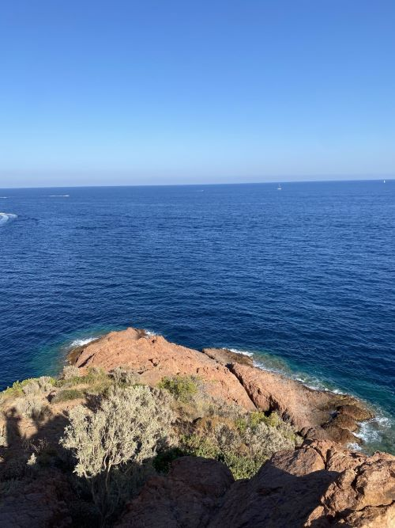
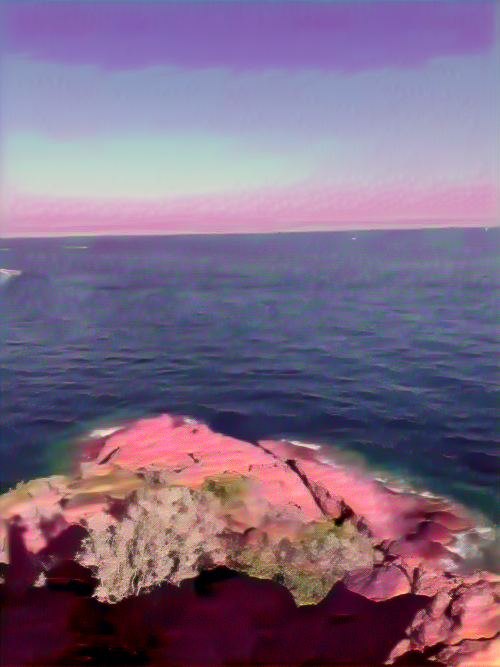
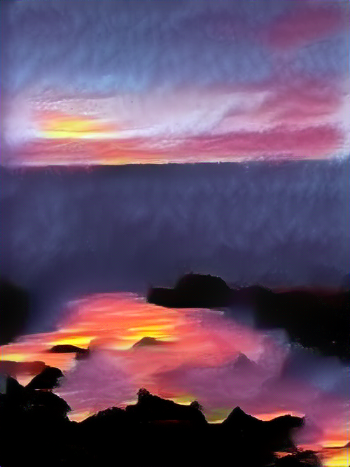

# Image Style Transfer Project

This project implements an image style transfer algorithm using a pre-trained VGG19 model. The goal is to generate a target image that combines the content of a source image with the style of another image.

## Features

- Loading and transforming images
- Extracting features from images using a pre-trained VGG19 model
- Calculating the Gram matrix for style representations
- Optimizing the target image to minimize content and style loss

## Code Structure

The code is organized into several functions:

### 1. `load_image(img_path, max_size=500, shape=None)`

This function loads an image from a given path, resizes it if necessary, and transforms it into a PyTorch tensor.

**Parameters:**
- `img_path`: Path of the image to load.
- `max_size`: Maximum size for the largest dimension of the image.
- `shape`: Target shape for the image (optional).

### 2. `im_convert(tensor)`

This function converts a normalized image tensor into a NumPy image for display.

### 3. `imshow(img)`

Utility function to display an image using Matplotlib.

### 4. `get_features(image, model, layers=None)`

This function passes an image through the VGG19 model and retrieves features for a specified set of layers.

**Parameters:**
- `image`: The image to process.
- `model`: The model used (VGG19).
- `layers`: The layers from which to extract features (optional).

### 5. `gram_matrix(tensor)`

This function calculates the Gram matrix of a given tensor. The Gram matrix is used to represent the style of an image.

### 6. Main Block

In the main block, the VGG19 model is loaded, and the content and style images are prepared. Then, the content and style features are extracted, and a target image is optimized using an Adam optimizer.

## Losses

The code minimizes two types of losses:

1. **Content Loss**: compares the feature representations of the content image and the generated image. Let $ P $ be the feature map of the content image, and $ F $ be the feature map of the generated image, both extracted from layer $ l $ of the network. The content loss is:

$$
L_{\text{content}}(P, F) = \frac{1}{2} \sum_{i,j} (F_{ij} - P_{ij})^2
$$

2. **Style Loss**: measures the differences between the style representations of the style image and the generated image, using the Gram matrices $ G $ and $ A $ of the generated image and the style image, respectively, extracted at layer $ l $. The Gram matrix $ G^l $ is computed by multiplying the feature map $ F^l $ by its transpose. The style loss is:

$$
L_{\text{style}}^l(A, G) = \frac{1}{2} \sum_{i,j} (G_{ij}^l - A_{ij}^l)^2
$$

## Usage

- Place the content and style images in the `data/` folder with the names `i.jpg` and `s.jpg` respectively.
- Run the Python script to generate a target image that combines the content of the source image and the style of the target image. The results will be saved in the `data/` folder with the prefix `output`.

## Notes

- Make sure the necessary libraries (PyTorch, torchvision, PIL, matplotlib, numpy) are installed before running the script.
- You can install the environment using the provided `environment.yml` file.
```bash
conda env create -f environment.yml
conda activate ml
```

## Results

The following images show the content, style, and target images generated by the algorithm:
| Content Image | Style Image | First Epoch Result | Last Epoch Result |
|---------------|-------------|--------------------|-------------------|
|  |  |  |  |